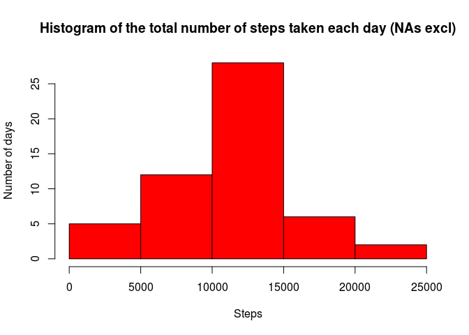
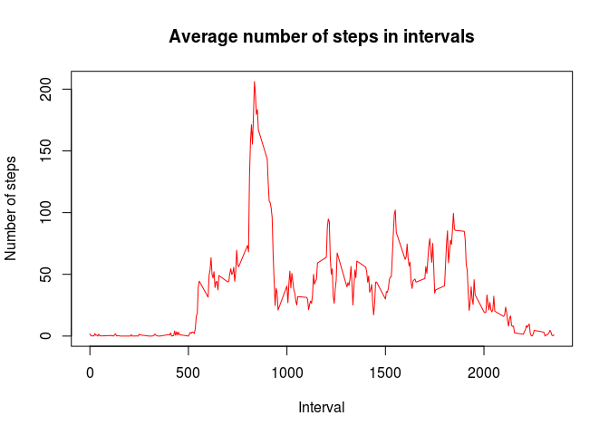
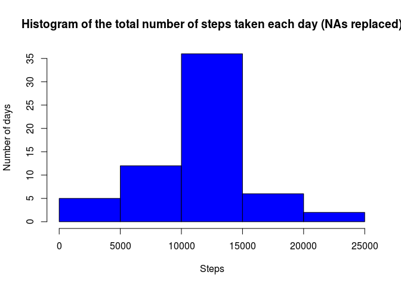
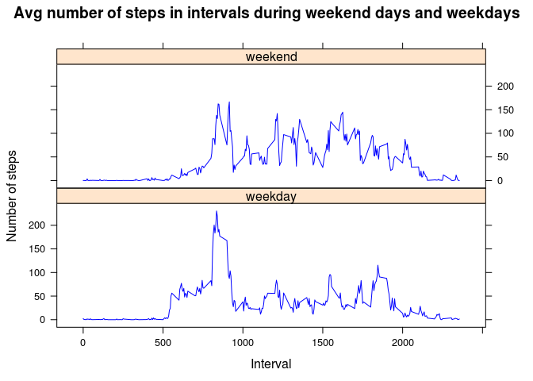

# Reproducible Research: Peer Assessment 1


## Loading and preprocessing the data

```r
dataInit <- read.csv("./activity.csv")
dataInit$date <- as.Date(as.character(dataInit$date))
```


## What is mean total number of steps taken per day?

```r
library(dplyr)

dataTotal <- dataInit %>% filter(is.na(steps) == FALSE) %>% group_by(date) %>% summarize(steps = sum(steps))
hist(dataTotal$steps, col = "red", main = "Histogram of the total number of steps taken each day (NAs excl)", xlab = "Steps", ylab = "Number of days")
```

<!-- -->

Mean:

```r
mean(dataTotal$steps)
```

```
## [1] 10766.19
```

Median:

```r
median(dataTotal$steps)
```

```
## [1] 10765
```


## What is the average daily activity pattern?

```r
dataActivityAverage <- dataInit %>% filter(is.na(steps) == FALSE) %>% group_by(interval) %>% summarize(steps = mean(steps))

plot(dataActivityAverage$interval, dataActivityAverage$steps, type="l", col = "red", main = "Average number of steps in intervals", xlab = "Interval", ylab = "Number of steps")
```

<!-- -->

The following interval contains the maximum number of steps on average across all the days in the dataset:

```r
dataActivityAverage[which.max(dataActivityAverage$steps),]$interval
```

```
## [1] 835
```


## Imputing missing values
  
Total number of missing values in the dataset:

```r
nrow(dataInit[is.na(dataInit$steps),])  
```

```
## [1] 2304
```
  
The strategy for filling in all of the missing values in the dataset: **use the mean for 5-minute intervals**

```r
# 1st step - create a data frame with interval means
dataMeanStepsByInterval <- dataInit %>% select(steps, interval) %>% filter(is.na(steps) == FALSE) %>% group_by(interval) %>% summarize(meanSteps = mean(steps)) %>% select(meanSteps, interval)

# 2nd step - join the data frame created in the 1st point with the initial data frame and replace NAs in the steps columns
dataImputted <- dataInit %>% inner_join(dataMeanStepsByInterval, by = "interval") %>% mutate(steps = ifelse(is.na(steps), meanSteps, steps))

dataTotalImputted <- dataImputted %>% group_by(date) %>% summarize(steps = sum(steps))
hist(dataTotalImputted$steps, col = "blue", main = "Histogram of the total number of steps taken each day (NAs replaced)", xlab = "Steps", ylab = "Number of days")
```

<!-- -->
Mean:

```r
mean(dataTotalImputted$steps)
```

```
## [1] 10766.19
```

Median:

```r
median(dataTotalImputted$steps)
```

```
## [1] 10766.19
```
Do these values differ from the estimates from the first part of the assignment?  
**Yes.**  
What is the impact of imputing missing data on the estimates of the total daily number of steps?  
**More days are displayed in the histogram. The third bar (the number of days when the total number of steps taken was between 10000 and 15000) is higher.**  


## Are there differences in activity patterns between weekdays and weekends?

```r
library(lattice)
Sys.setlocale("LC_TIME", "en_US.UTF-8")

dataActivityByWeekpart <- dataImputted %>% mutate(day = weekdays(date)) %>% mutate(weekpart = as.factor(ifelse(day == "Saturday" | day == "Sunday", "weekend", "weekday"))) %>% group_by(.dots = c("interval", "weekpart")) %>% summarize(steps = mean(steps))

xyplot(steps ~ interval | weekpart, data = dataActivityByWeekpart, main = "Avg number of steps in intervals during weekend days and weekdays", layout = c(1,2), type = "l", col = "blue", xlab = "Interval", ylab = "Number of steps" )
```

<!-- -->
